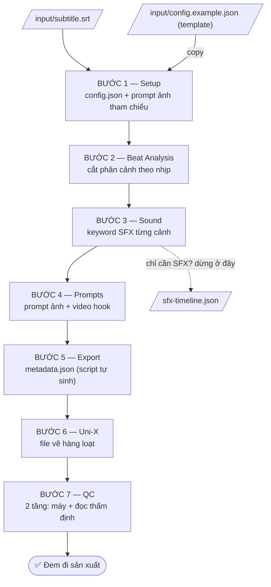

# WMG Storyboard Prompt Generator — Hướng dẫn tổng quan

> Tài liệu này dành cho **người dùng**. Quy trình chi tiết cho AI nằm ở `CLAUDE.md` + `.claude/skills/` — bạn không cần đọc chúng để vận hành.

## 1. Hệ thống này làm gì?

Biến **kịch bản + file phụ đề (SRT)** thành trọn bộ nguyên liệu sản xuất video storytelling dạng slideshow cho khán giả 65+:

- **Bộ prompt ảnh AI** (Nano Banana / Uni-X Studio) cho từng phân cảnh — đã cắt nhịp, khóa nhân vật, khóa style.
- **Prompt video hook** (Flow / Veo) cho ~1 phút đầu giữ chân người xem.
- **metadata.json** — bản đồ dựng phim: ảnh nào ↔ giây nào ↔ âm thanh gì ↔ chữ đánh máy gì.
- **SFX timeline** — keyword âm thanh theo timestamp (dùng độc lập được).

Nguyên tắc vận hành: **AI làm nội dung — máy kiểm chất lượng.** Mỗi bước có lệnh "gate" chấm điểm tự động; gate chưa PASS thì bước đó chưa xong, bất kể AI nói gì.

## 2. Đầu vào — bỏ file vào `input/`

| File | Bắt buộc? | Là gì |
|---|---|---|
| `subtitle.srt` | ✅ BẮT BUỘC | Phụ đề có timestamp — xương sống của toàn bộ timeline. Tên file phải đúng `subtitle.srt` |
| `config.example.json` | ✅ (có sẵn) | TEMPLATE gốc bạn quản lý (mood_map, video_hook mặc định...). Dự án mới tự copy thành `config.json` — pipeline không bao giờ sửa template |
| `script.txt` | ⬜ tùy chọn | Kịch bản gốc — AI đọc bổ trợ khi phân tích |
| `typewriter.json` | ⬜ tùy chọn | Cue hiệu ứng chữ đánh máy (con số, time card, câu thesis). Không có → Bước 5 sẽ đề xuất cho bạn duyệt |
| `config.json` | 🤖 tự sinh | Sinh từ template ở Bước 1, AI điền từ SRT, **bạn review + chốt** (style, nhân vật, bối cảnh) |

**Bắt đầu dự án mới = 1 việc duy nhất: bỏ `subtitle.srt` mới vào `input/` rồi nói "chạy bước 1".** (Config cũ được tự archive vào `archive/`.)

## 3. Luồng chạy — 7 bước, mỗi bước 1 câu lệnh nói với AI

| Bước | Bạn nói | AI làm | Kết quả trong `output/` | Xong khi |
|---|---|---|---|---|
| 1 | "chạy bước 1" | Copy template → config, đọc SRT điền nhân vật/bối cảnh, hỏi bạn chốt style | `character-refs.md` + `character-refs-list.txt` (paste vẽ hàng loạt) + `character-refs-map.txt` (đổi tên ảnh) | `--step1` PASS + bạn chốt config |
| 2 | "chạy bước 2" | Cắt SRT thành phân cảnh (10–14s/ảnh), gán beat + mood | `scene-breakdown.md` | `--step2` PASS |
| 3 | "chạy bước 3" | Suy keyword âm thanh diegetic từng cảnh | `sfx.json` + `sfx-timeline.json` (module độc lập) | `--step3` PASS |
| 4 | "chạy bước 4" | Viết prompt ảnh 5 phần mọi cảnh + video hook | `prompts.md` + `video-prompts.md` | `--step4` PASS |
| 5 | "chạy bước 5" | Chạy script ráp + validate toàn bộ | `metadata.json` + `typewriter-cues.md` | export PASS |
| 6 | "chạy bước 6" | Xuất cú pháp Uni-X, gắn asset tag | `unix-batch-NN.txt` (+ `prompts-list.txt`) | rà xong scene thiếu tag |
| 7 | "chạy QC" | Máy quét toàn bộ + AI đọc thẩm định hook/mood/khớp lời | `qc-report.md` có verdict | `--qc` PASS + verdict PASS |

**Mẹo vận hành:**
- Video dài → **mỗi bước 1 phiên chat mới** (dữ liệu nằm hết trong file, không cần lịch sử chat).
- Quên đang dở bước nào? Chạy lần lượt: `python3 scripts/export.py --step1 / --step2 / --step3 / --step4 / --validate` — gate đầu tiên báo FAIL chính là chỗ đang dở.
- Bước 2–4 chạy model nhỏ để tiết kiệm; QC (Bước 7) nên dùng model mạnh. Gate máy đảm bảo model nào cũng phải đạt cùng chuẩn.
- "chạy toàn bộ pipeline" = chạy tuần tự 1→7, dừng chờ bạn chốt config ở Bước 1.

## 4. Đầu ra — `output/` có gì, dùng vào việc gì

### Nhóm A — để VẼ ẢNH (đưa vào Uni-X Studio / Flow)

| File | Dùng thế nào |
|---|---|
| `character-refs-list.txt` | Copy cả file → paste vào công cụ vẽ → ra loạt ảnh ingredient (nhân vật + bối cảnh) đúng thứ tự |
| `character-refs-map.txt` | Bảng `N -> TAG.jpg` — đổi tên ảnh vừa vẽ theo map, rồi upload lên Uni-X/Flow làm ingredient |
| `character-refs.md` | Bản đọc chi tiết từng prompt ref (kèm header đếm asset để tick) |
| `unix-batch-NN.txt` | Paste vào Uni-X Studio vẽ ảnh scene hàng loạt (100 ảnh/file, có sẵn `[TAG]` tham chiếu ingredient) — **chỉ dùng sau khi Bước 7 PASS** |
| `prompts-list.txt` | (tùy chọn) prompt đánh số phẳng cho công cụ khác |
| `video-prompts.md` | Prompt video hook cho Flow/Veo — mỗi clip 1 cú cắt, kèm image prompt của ảnh nền |

### Nhóm B — để DỰNG VIDEO (đưa cho editor / tool dựng)

| File | Dùng thế nào |
|---|---|
| `metadata.json` | Bản đồ dựng: mỗi scene có `start/end`, tên file ảnh (`5.jpg`), `sfx` keywords, cue `typewriter` (kèm `type_s` = giây gõ chữ) |
| `typewriter-cues.md` | Bảng cue đánh máy cho editor — đầu file có QUY TẮC ÂM THANH (âm gõ phím chỉ tại `Time`, dừng sau `Gõ (s)`; cảnh không cue = không âm gõ) |
| `sfx-timeline.json` | **Module độc lập**: timestamp + keyword sfx + mood từng cảnh — thả vào folder dựng khác cùng subtitle + voiceover là khớp timeline |
| `qc-report.md` | Biên bản kiểm định — đọc phần verdict trước khi sản xuất |

### File trung gian (không cần đụng tay)

`scene-breakdown.md`, `sfx.json`, `prompts.md` — nguồn để script ráp `metadata.json`. Muốn sửa gì thì sửa Ở NGUỒN rồi chạy lại Bước 5, **không sửa tay `metadata.json`/`typewriter-cues.md`** (là file máy sinh, lần export sau sẽ đè mất).

## 5. Kết quả cuối cùng — checklist mang đi sản xuất

Sau khi Bước 7 PASS, bạn cầm đi:

1. ☐ **Bộ ảnh ingredient** — vẽ từ `character-refs-list.txt`, đã đổi tên theo `character-refs-map.txt`, upload lên Uni-X/Flow.
2. ☐ **Ảnh scene** — vẽ hàng loạt từ `unix-batch-NN.txt`, đặt tên `1.jpg`, `2.jpg`... theo stt.
3. ☐ **Clip hook** — generate từ `video-prompts.md` trên Flow/Veo.
4. ☐ **`metadata.json`** — cho editor/tool ghép ảnh đúng timeline + đặt sfx + chữ đánh máy.
5. ☐ **`typewriter-cues.md`** — editor làm hiệu ứng chữ + âm gõ phím đúng quy tắc đầu file.
6. ☐ **`sfx-timeline.json`** — editor tìm sound theo keyword, đặt theo timestamp.

## 6. Chế độ rút gọn: chỉ cần SFX

Chỉ cần âm thanh cho 1 kịch bản (không làm ảnh):

1. Bỏ `subtitle.srt` vào `input/` → "chạy bước 1" và nói rõ **chỉ cần SFX** (AI sẽ bỏ qua phần vẽ ảnh tham chiếu).
2. "chạy bước 2" → "chạy bước 3".
3. Cầm `output/sfx-timeline.json` đi dùng — timestamp cùng timeline SRT/voiceover nên tự khớp.

## 7. Khi có lỗi

- AI tự ghi bug vào `KAIZEN.md` (hiện tượng → gốc rễ → phòng ngừa) và thêm check vào gate để không lặp lại.
- Bạn báo lỗi ở scene nào → AI chỉ sửa đúng scene đó rồi chạy lại gate, không viết lại cả file.
- Đọc `KAIZEN.md` nếu muốn xem lịch sử các lỗi đã gặp và cách hệ thống đã vá.
